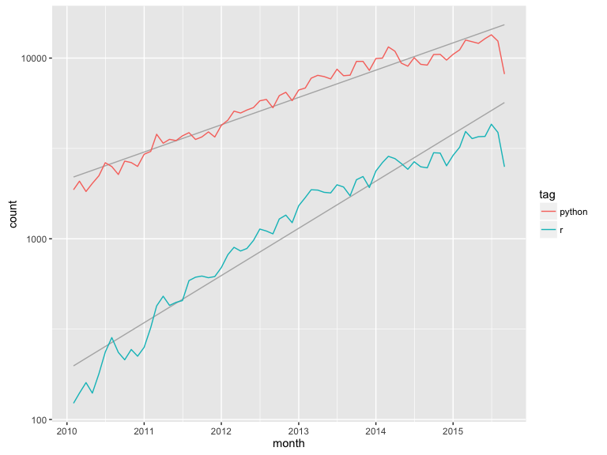
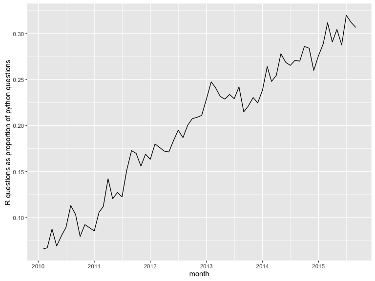
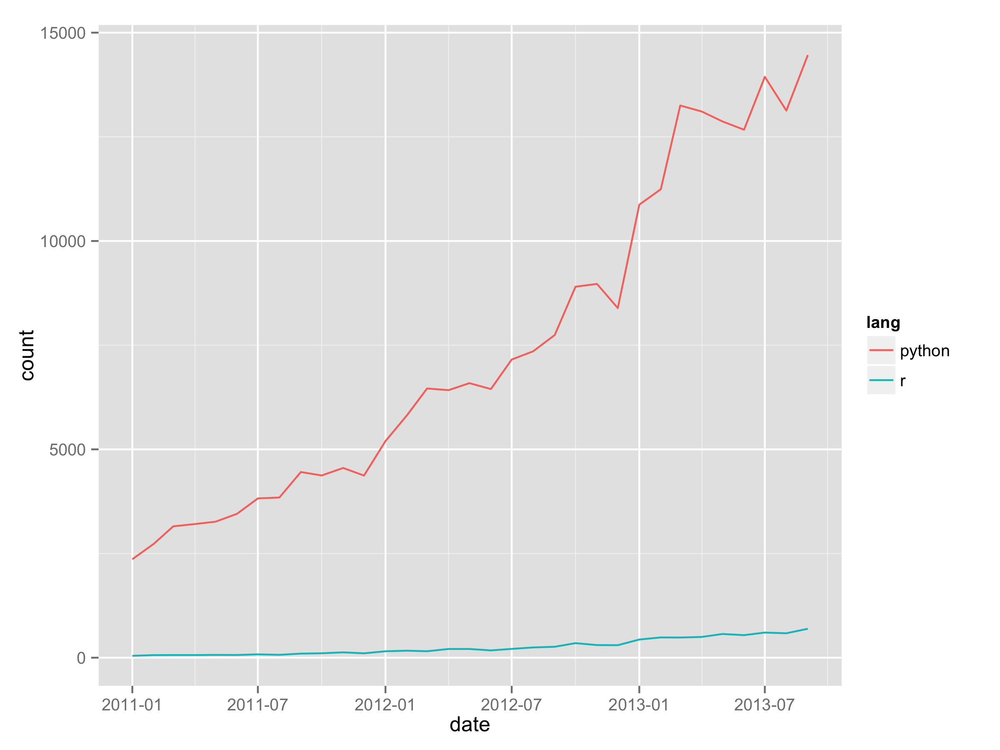
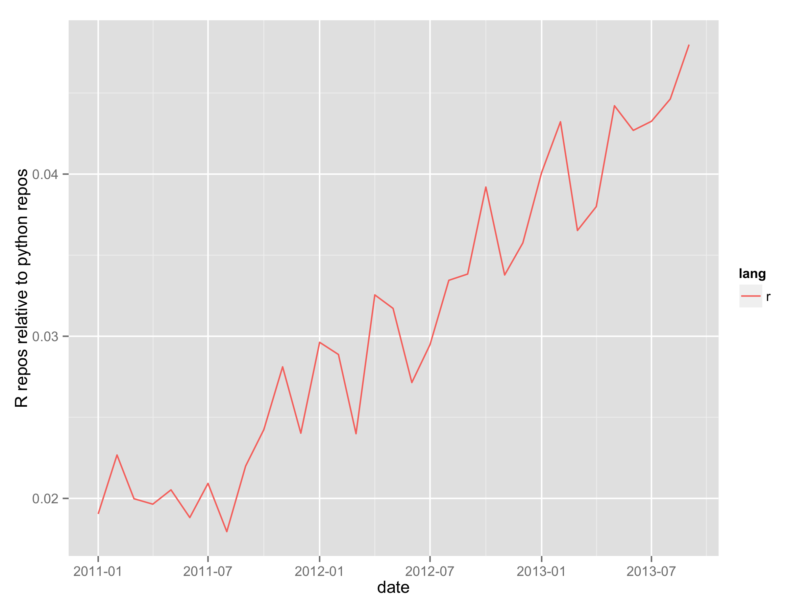

# R and python usages

This repo is an attempt to use data to explore the claims in [Python Displacing R As The Programming Language For Data Science](http://t.co/jdR2WF4Kjg) and [The homogenization of scientific computing, or why Python is steadily eating other languages’ lunch](http://bit.ly/1geFq6e).

The individual files contain the R code that I used to gather data from each source, and the results are summarised below. I've made no attempt to separate python for data analysis from other uses of python, but hopefully the signals are still indicative. If you think my methodology is wrong, or you have other ideas for data sets, please send a pull request and I'll merge it in.

## Stackoverflow questions

Using the [stackexchange data explorer](http://data.stackexchange.com/stackoverflow/query/150128/r-questions-per-month), I calculated the number of questions asked by month for both python and R. Overall, both R and python questions are growing explosively over time:

A little further exploration (not shown) indicates that this is very close to being exponential growth.  

If we standardise the number of R questions by the number of python questions, we see that R the number of R questions is increasing more rapidly than python. Currently, about 1 question about R is asked for every three questions asked about python.

 

## Github repos

Again we see exponential growth in both repos containing R code and repos containing python code (these number don't include forks), but R repo's are relatively less common than R questions. The big jump in repo creation in 2014 is probably due the [JHU coursera course](https://www.coursera.org/course/datascitoolbox).

If we standardise the number of R repos by the number of python repos, we see that R has been decreasing since the big jump in 2015.

 

## Google trends

Looking at [google trends data](http://www.google.com/trends/explore#q=r%20tutorial%2C%20python%20tutorial&cmpt=q) for people searching for language tutorials, both languages are relatively flat. Growth in searches for R tutorials is relatively flat, perhaps with a slight increases, while growth for python searches has been considerably more variable over time.

## Other ideas

* Look at use of mailing lists. Is there a pydata specific mailing list?
* Compare twitter hashtags: rstats, python, pydata?
* Compare package downloads?
